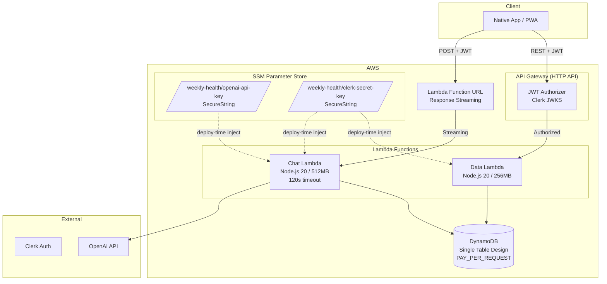

# Weekly Health - AWS Infrastructure

Serverless backend deployed with AWS CDK. Single stack, two Lambda functions, one DynamoDB table.

## Architecture



## What's in the Stack

| Resource                            | Purpose                                                                                                                      |
| ----------------------------------- | ---------------------------------------------------------------------------------------------------------------------------- |
| **DynamoDB Table** (`WeeklyHealth`) | Single-table design. PK/SK string keys. Pay-per-request billing.                                                             |
| **Data Lambda**                     | Handles all CRUD: entries, activities, profile, weekly summaries. Behind API Gateway with JWT auth.                          |
| **Chat Lambda**                     | AI streaming via OpenAI. Uses Lambda Function URL with `RESPONSE_STREAM` invoke mode. Validates JWT itself (no API Gateway). |
| **HTTP API (API Gateway v2)**       | Routes REST requests to Data Lambda. JWT authorizer validates Clerk tokens.                                                  |
| **Lambda Function URL**             | Direct invocation endpoint for Chat Lambda with streaming support.                                                           |

## API Routes (via API Gateway)

All routes require Clerk JWT in `Authorization` header.

| Method     | Path                      | Handler                   |
| ---------- | ------------------------- | ------------------------- |
| GET        | `/summary`                | App init / weekly summary |
| GET        | `/weeks/{weekId}`         | Get specific week         |
| POST       | `/entries`                | Create meal entry         |
| PUT/DELETE | `/entries/{date}/{id}`    | Update/delete entry       |
| POST/PUT   | `/profile`                | Create/update profile     |
| GET        | `/activities/{date}`      | Get activities by date    |
| POST       | `/activities`             | Create activity           |
| PUT/DELETE | `/activities/{date}/{id}` | Update/delete activity    |

Chat endpoint is **not** behind API Gateway — it uses a Lambda Function URL directly for streaming.

## Secrets Management

Sensitive secrets are stored in **SSM Parameter Store (SecureString)** — free tier, encrypted with AWS KMS.

| Parameter                         | Used by      |
| --------------------------------- | ------------ |
| `/weekly-health/openai-api-key`   | Chat Lambda  |
| `/weekly-health/clerk-secret-key` | Both Lambdas |

Secrets are resolved at **deploy time** via `cdk.SecretValue.ssmSecure()` and injected into Lambda environment variables. Your application code just reads `process.env` — no AWS SDK calls at runtime for secrets.

Non-sensitive config (`JWT_ISSUER`) comes from `.env` at CDK synth time.

## Key Decisions

- **Single stack** — everything in one `WeeklyHealthServerlessStack`
- **No VPC** — Lambdas run in AWS-managed network (faster cold starts, simpler)
- **`removalPolicy: DESTROY`** — DynamoDB table gets deleted on `cdk destroy` (change for prod data safety)
- **Chat uses Function URL, not API Gateway** — needed for HTTP response streaming
- **Chat Lambda self-validates JWT** — fetches Clerk JWKS at cold start, verifies tokens itself
- **`externalModules: ["@aws-sdk/*"]`** — AWS SDK excluded from bundle (provided by Lambda runtime)
- **CORS `*`** — wide open for now; tighten for production

## Deploy from Scratch

### Prerequisites

- AWS CLI configured (`aws configure`)
- Node.js 20+
- pnpm (workspace uses pnpm)
- AWS CDK CLI (`npm i -g aws-cdk`)

### Step 1: Install dependencies

```bash
pnpm install
```

### Step 2: Create `.env` file

```bash
cp .env.example .env
# Fill in:
#   JWT_ISSUER=https://your-app.clerk.accounts.dev
#   OPENAI_API_KEY=sk-...
#   CLERK_SECRET_KEY=sk_live_...
```

### Step 3: Push secrets to SSM

```bash
./scripts/push-secrets.sh
```

This reads from `.env` and creates SecureString parameters in SSM.

### Step 4: Bootstrap CDK (first time only)

```bash
npx cdk bootstrap
```

### Step 5: Deploy

```bash
npx cdk deploy
```

Note the outputs:
- **ApiUrl** — REST endpoint for the native/PWA app
- **ChatUrl** — Streaming endpoint for AI chat

### Tear Down

```bash
# Destroy the stack (deletes all AWS resources)
npx cdk destroy

# Remove secrets from SSM
./scripts/destroy-secrets.sh
```

## Redeploying After Code Changes

```bash
# Just redeploy — CDK handles the diff
npx cdk deploy
```

If you rotated a secret:
```bash
# Update the value in .env, then:
./scripts/push-secrets.sh
npx cdk deploy   # redeploy to pick up new secret value
```

## File Structure

```
apps/aws-infra/
├── bin/index.ts              # CDK app entry point
├── lib/serverless-stack.ts   # All infrastructure defined here
├── functions/
│   ├── data/                 # CRUD Lambda (routes.ts, index.ts)
│   ├── chat/                 # AI streaming Lambda
│   └── shared/               # Shared utilities (http.ts)
├── scripts/
│   ├── push-secrets.sh       # Push secrets from .env → SSM
│   └── destroy-secrets.sh    # Delete secrets from SSM
├── .env.example              # Template for local config
└── cdk.json                  # CDK configuration
```
